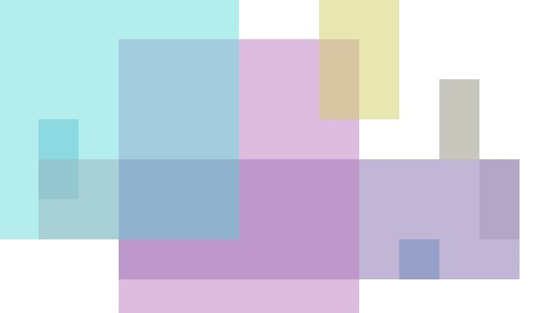
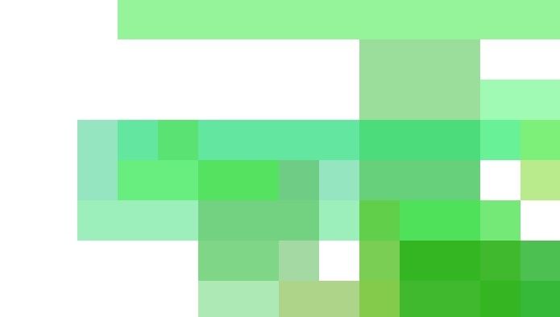
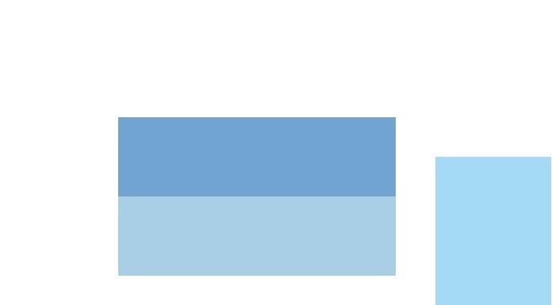
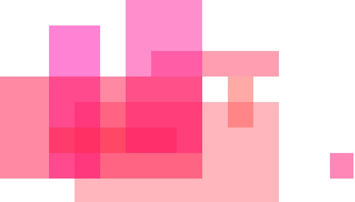

# Electron ArtGEN

This app is intended as an exploration into the features of Electron, since I have never used this framework before.

My goal is to make an application that can generate pseudo-random artpieces. In doing so, I will be able to learn a number things about creating apps in Electron:
- how to build & deploy on multiple platforms
- how to organize a multi-level project in a hierarchy
- how to work within the Electron framework through reading their documentation
- and more!

---

## Examples

### Random Colors
 

### Happy
 

### Calm
 

### Love
 

### Empty
 

---

## Resources

- Core HTML and JavaScript files are based on Electron's simple sample projects, specifically the hash project
    - https://github.com/electron/simple-samples/tree/master/hash 
- Grid layout used for generating some of the artwork
    - https://www.smashingmagazine.com/2018/02/generated-content-grid-layout/
	- https://www.w3schools.com/css/css_grid_item.asp 
- Emotional effect of colors
    - https://londonimageinstitute.com/how-to-empower-yourself-with-color-psychology/ 

	
